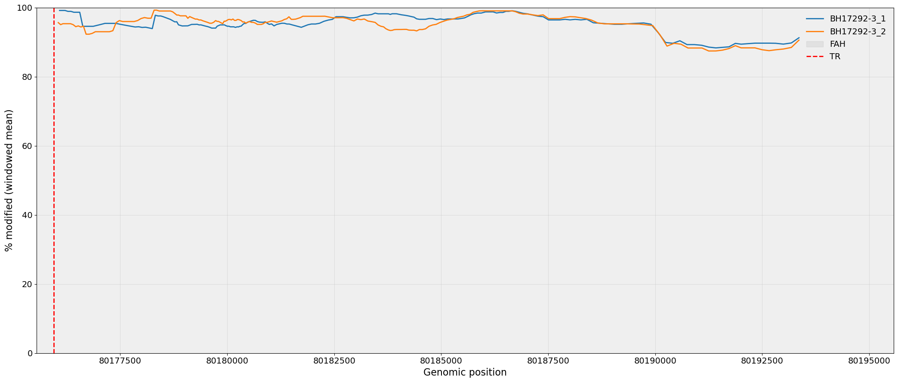

# methylplotter

Plot methylation from haplotype‑phased BED files.

A small utility to generate publication‑style methylation plots, for example:

## Features
- Generate per‑region methylation profiles from phased BED input
- Support multiple samples and haplotypes
- Produce PNG/SVG output suitable for figures
## Usage

         methylplotter [-h] [-v] -p PLATFORM -b BED -s SAMPLE -g GENE [-r REGION] [-o OUTPUT] [-l LINE] [-w WINDOW_SIZE] [-m MIN_POINTS_FOR_SMOOTH]
        plot methylation from haplotype phased BED or BAM files

        options:
        -h, --help            show this help message and exit
        -v, --version         show program's version number and exit
        -p PLATFORM, --platform PLATFORM
                                Sequencing platform: ont or pb
        -b BED, --bed BED     Input haplotype-phased BED file(s)
        -s SAMPLE, --sample SAMPLE
                                Sample name(s), in the same order as BED files
        -g GENE, --gene GENE  Gene info: format chr:start-end:name, e.g., chr15:80143550-80197576:FAH
        -r REGION, --region REGION
                                Region to plot: format chr:start-end, e.g., chr15:80150000-80200000. If not provided, use the gene coordinates +- 500 bps.
        -o OUTPUT, --output OUTPUT
                                Output prefix for plots (default: gene_methylation.pdf)
        -l LINE, --line LINE  A comma-separated (name,position) to draw vertical lines at (e.g., TR breakpoint)
        -w WINDOW_SIZE, --window_size WINDOW_SIZE
                                Window size (bp) for smoothing (default: 20)
        -m MIN_POINTS_FOR_SMOOTH, --min_points_for_smooth MIN_POINTS_FOR_SMOOTH
                                Minimum number of points required for smoothing (default: 3)

        Version v0.1
