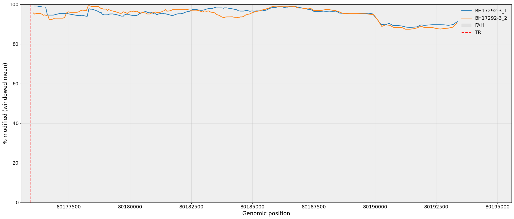

# methylplotter

Plot methylation from haplotype-phased BED files.



## What It Does
- Parses ONT/PacBio BED-like methylation files
- Filters records to a genomic region
- Applies sliding-window smoothing to `% modified`
- Draws publication-ready line plots for one or more samples
- Annotates genes and optional vertical marker lines

## Installation

```bash
python -m pip install .
```

For development with tests:

```bash
python -m pip install -e '.[test]'
```

## CLI Usage

```bash
methylplotter \
  --platform ont \
  --bed sampleA.bed --bed sampleB.bed \
  --sample sampleA --sample sampleB \
  --gene chr15:80143550-80197576:FAH \
  --region chr15:80150000-80200000 \
  --line breakpoint,80170000 \
  --window_size 20 \
  --min_points_for_smooth 3 \
  --output methylation_plot
```

Notes:
- `--platform ont` uses methylation percent from BED column index `10`
- `--platform pb` uses methylation percent from BED column index `8`
- If `--output` has no extension, both `PNG` and `SVG` are written

## Test Data
Synthetic test data is bundled in [`tests/data/`](/users/u254106/Yilei/130/methylplotter/tests/data):
- `ont_sample_a.bed`
- `ont_sample_b.bed`
- `pb_sample_a.bed`

These are minimal fixtures for parser/smoother/plot tests, not biological reference datasets.

## Run Tests

```bash
PYTHONPATH=src pytest
```
